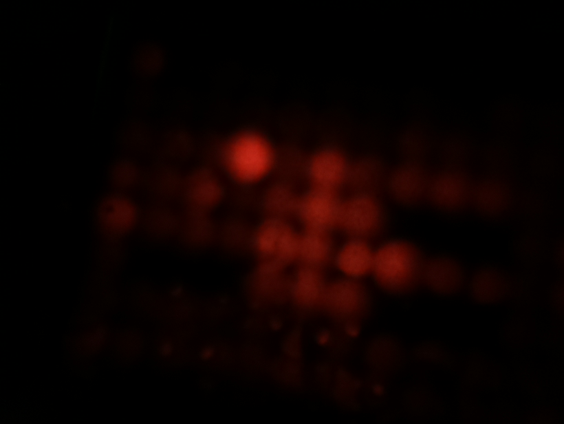
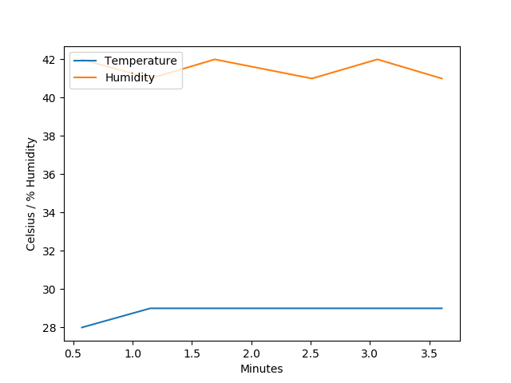
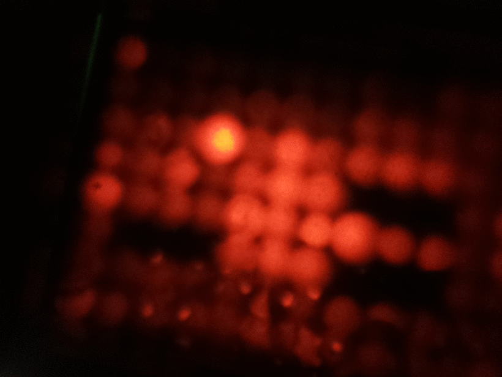

# Bixel

A script and hardware design for creating a low-cost plate reader using a raspberry pi and lego!

1. Equipment/Parts
2. Code

## Equipment

- Raspberry pi (zero, 3 or 4)
- raspicam
- DHT 11 sensor
- [Adafruit neopixel](https://www.adafruit.com/product/1487) 
- Optical filters
- Fan

Insert image

## Code

To Run:

Install nginx
`sudo apt intall nginx`

Edit the default file to point to your bixel directory. If you are using a raspi as user pi then your directory will be `\home\pi\bixel`

`sudo nano \etc\nginx\sites-available\default`

type ctrl+w and enter root to find the line:
``

<html>
<head>
<title>Bixel output screen</title>
</head>
<body>

<h1>Bixel output screen</h1>
<h2>ISO 100: First and Latest Images</h2>

<h2>ISO 800: First and Latest Images</h2>

<h2>Temperature & Humidity Graph, Timeline GIF</h2>

</body>
</html>
